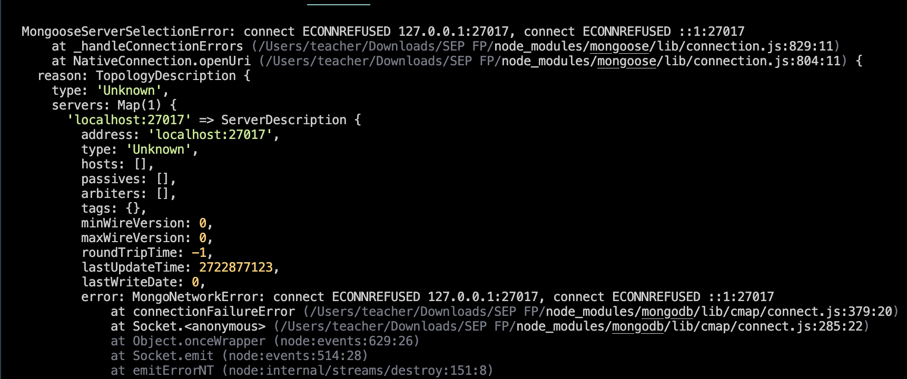

# Tool Learning Log

Tool: **Node.JS**

Project: **REST API that serves train and animal images**

---

12/4/23:
* Today I ran node -v in terminal and realized that Node.JS was installed on the IDE by default.

12/12/23:
* Today, I experimented with Express and couldn't get it to open in a browser window, so I did some research and found that I needed to add a port for it to open in a browser window.

2/5/24
* Today, I started experimenting with Mongoose because of a tutorial I found, and I quickly realized it wasn't gonna work, as I keep getting errors.

<!--
* Links you used today (websites, videos, etc)
* Things you tried, progress you made, etc
* Challenges, a-ha moments, etc
* Questions you still have
* What you're going to try next
-->
